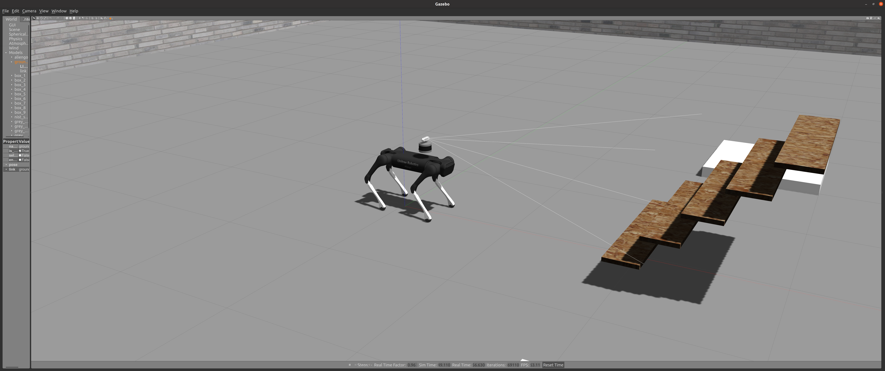

# quadruped_navigation
This is a package for quadruped robot navigation

## quadruped robot control
legged_control is an NMPC-WBC legged robot control stack and framework based
on [OCS2](https://github.com/leggedrobotics/ocs2) and [ros-control](http://wiki.ros.org/ros_control).

The advantage shows below:

1. To the author's best knowledge, this framework is probably the best-performing open-source legged robot MPC control
   framework;
2. You can deploy this framework in your A1 robot within a few hours;
3. Thanks to the ros-control interface, you can easily use this framework for your custom robot.

I believe this framework can provide a high-performance and easy-to-use model-based baseline for the legged robot
community.


### Source code

The source code is hosted on GitHub: [qiayuanliao/legged_control](https://github.com/qiayuanliao/legged_control).

```
# Clone legged_control
git clone git@github.com:qiayuanliao/legged_control.git
```

### OCS2

OCS2 is a huge monorepo; **DO NOT** try to compile the whole repo. You only need to compile `ocs2_legged_robot_ros` and
its dependencies following the step below.

1. You are supposed to clone the OCS2, pinocchio, and hpp-fcl as described in the documentation of OCS2.
   ```
   # Clone OCS2
   git clone git@github.com:leggedrobotics/ocs2.git
   # Clone pinocchio
   git clone --recurse-submodules https://github.com/leggedrobotics/pinocchio.git
   # Clone hpp-fcl
   git clone --recurse-submodules https://github.com/leggedrobotics/hpp-fcl.git
   # Clone ocs2_robotic_assets
   git clone https://github.com/leggedrobotics/ocs2_robotic_assets.git
   # Install dependencies
   sudo apt install liburdfdom-dev liboctomap-dev libassimp-dev
   ```
2. Compile the `ocs2_legged_robot_ros` package with [catkin tools](https://catkin-tools.readthedocs.io/en/latest/)
   instead of `catkin_make`. It will take you about ten minutes.
   ```
   catkin config -DCMAKE_BUILD_TYPE=RelWithDebInfo
   catkin build ocs2_legged_robot_ros ocs2_self_collision_visualization
   ```

### Build

Build the source code of `legged_control` by:

```
catkin build legged_controllers legged_unitree_description
```

Build the simulation (**DO NOT** run on the onboard computer)

```
catkin build legged_gazebo
```

Build the hardware interface real robot. If you use your computer only for simulation, you **DO NOT** need to
compile `legged_unitree_hw` (TODO: add a legged prefix to the package name)

```
catkin build legged_unitree_hw
```

## Camera and Lidar
We use **Aliengo** with **VLP-16**, **camera** and **IMU** to verify on the gazebo.

The topics of sensors are

```
CloudTopic: "/velodyne_points" 
imuTopic: "/imu/data"   
image_topic: "/camera/image_raw"
```

You can check the details in the configuration file.

## Quick Start

1. Set your robot type as an environment variable: ROBOT_TYPE

```
export ROBOT_TYPE=a1
```

2. Run the simulation:

```
roslaunch legged_unitree_description empty_world.launch
```

Or on the robot hardware:

```
roslaunch legged_unitree_hw legged_unitree_hw.launch
```

3. Load the controller:

```
roslaunch legged_controllers load_controller.launch cheater:=false
```

4. Start the `legged_controller` or `legged_cheater_controller`, **NOTE that you are not allowed to start
   the `legged_cheater_controller` in real hardware!**

```
rosservice call /controller_manager/switch_controller "start_controllers: ['controllers/legged_controller']                   
stop_controllers: ['']
strictness: 0
start_asap: false
timeout: 0.0" 
```

Or, you can start the controller using `rqt_controller_manager` GUI:

```
sudo apt install ros-noetic-rqt-controller-manager
rosrun rqt_controller_manager rqt_controller_manager
```

5. Set the gait in the terminal of `load_controller.launch`, then use RViz (you need to add what you want to display by
   yourself) and control the robot by `cmd_vel` and `move_base_simple/goal`:
   
7. start the map and navigation
   ```
   roslaunch start build_map.launch
```
